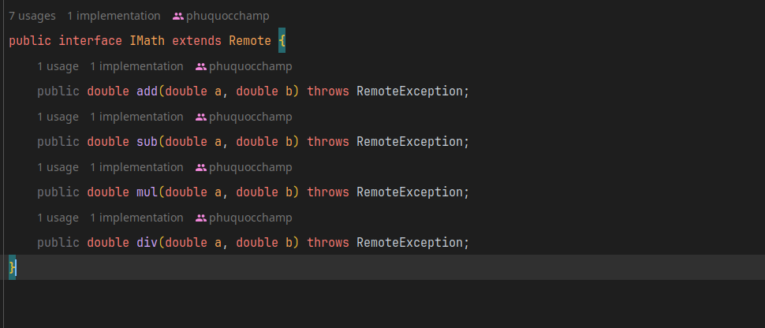

Java RMI-based Application for Secure Login and Calculator Operations

Description:

The Java RMI (Remote Method Invocation) application presented here is a versatile and secure system that seamlessly combines user authentication and a calculator service. The application employs a client-server architecture to facilitate remote method invocation for user login and basic calculator operations.

### Features:

1. **User Authentication:**
    - The application ensures secure user authentication by requiring a valid username and password for login.
    - User account information is securely stored, and passwords are hashed for added security.
    - Access control mechanisms are in place to prevent unauthorized access.
    - Login view

      
    - Encrypt code
    
2. ** Calculator Operations:**
    - The system provides a calculator service with four basic operations: addition, subtraction, multiplication, and division.
    - Users can remotely invoke these calculator operations by passing two double values as parameters.
    
   - Remote Interface
   
3. **Client-Server Architecture:**
    - The application follows a client-server model using Java RMI for communication between the client and server.
    - The server exposes remote methods for user authentication and calculator operations.
    - The client invokes these remote methods seamlessly, allowing users to perform operations from their local environment.

### How to Use:

1. **Server Setup:**
    - Run the server application on a designated machine.
    - Ensure that the server is accessible to clients over the network.

2. **Client Interaction:**
    - Users run the client application locally on their machines.
    - They initiate the login process by providing a valid username and password.
    - Once authenticated, users can perform calculator operations by inputting two double values and selecting the desired operation.

3. **Error Handling:**
    - The application provides informative error messages for various scenarios, such as incorrect login credentials or division by zero.

This Java RMI-based application offers a secure and efficient solution for user authentication and remote calculator operations, making it suitable for various distributed computing scenarios.


### Code Demo
1. Ilogin Interface
```java
package rmi_project_3;

import java.rmi.Remote;
import java.rmi.RemoteException;
import java.security.NoSuchAlgorithmException;

public interface ILogin extends Remote {
    boolean login(String username, String password) throws RemoteException, NoSuchAlgorithmException;
}

```
2. IMath interface
```java
package rmi_project_3;

import java.rmi.Remote;
import java.rmi.RemoteException;

public interface IMath extends Remote {
    public double add(double a, double b) throws RemoteException;
    public double sub(double a, double b) throws RemoteException;
    public double mul(double a, double b) throws RemoteException;
    public double div(double a, double b) throws RemoteException;
}
```
#### Client
```java
package rmi_project_3.Client;


import rmi_project_3.ILogin;
import rmi_project_3.IMath;

import java.rmi.registry.LocateRegistry;
import java.rmi.registry.Registry;
import java.security.MessageDigest;
import java.security.NoSuchAlgorithmException;
import java.util.Scanner;

public class RMIClient {
    private static String hashCode(String password) throws NoSuchAlgorithmException {
        MessageDigest md = MessageDigest.getInstance("SHA-256");
        byte[] hashedBytes = md.digest(password.getBytes());

        // Convert byte array to hexadecimal format
        StringBuilder sb = new StringBuilder();
        for (byte b : hashedBytes) {
            sb.append(String.format("%02x", b));
        }
        return sb.toString();
    }
    public static void main(String[] args) {

        try(Scanner inp = new Scanner(System.in)){
            Registry registry = LocateRegistry.getRegistry("localhost",1099);
            IMath iMathStub = (IMath) registry.lookup("Calculator");
            ILogin iLoginStub = (ILogin) registry.lookup("Login");
            boolean checkAuth = true;
            while(checkAuth){

                System.out.println("1. Login into program");
                System.out.println("2. Exit into program");
                System.out.print("Enter your choice: ");
                int authOption = Integer.parseInt(inp.nextLine());
                if(authOption == 1){
                    System.out.print("Enter your username : ");
                    String username = inp.nextLine();
                    System.out.print("Enter your password : ");
                    String password = inp.nextLine();

                    if(iLoginStub.login(hashCode(username), hashCode(password))){
                        int option;
                        boolean check = true;
                        while (check){
                            System.out.println("1. Cal sum of two number");
                            System.out.println("2. Cal subtract of two number");
                            System.out.println("3. Cal multiple of two number");
                            System.out.println("4. Cal divide of two number");
                            System.out.println("5. Exit");
                            System.out.print("Enter your choice: ");
                            option = Integer.parseInt(inp.nextLine());
                            System.out.print("Enter number A: ");
                            double a = Double.parseDouble(inp.nextLine());
                            System.out.print("Enter number B: ");
                            double b = Double.parseDouble(inp.nextLine());
                            switch (option){
                                case 1:
                                    System.out.println("Sum of A and B is :" + iMathStub.add(a, b));
                                    break;
                                case 2:
                                    System.out.println("Subtract of A and B is :" + iMathStub.sub(a, b));
                                    break;
                                case 3:
                                    System.out.println("Multiple of A and B is :" + iMathStub.mul(a, b));
                                    break;
                                case 4:
                                    System.out.println("Divide of A and B is :" + iMathStub.div(a, b));
                                    break;
                                case 5:
                                    check = false;
                                    break;
                            }
                        }

                    }else{
                        System.out.println("Please login again");
                    }
                }else{
                    break;
                }
            }


        }catch (Exception e){
            e.printStackTrace();
        }
    }
}

```
#### Server
1. IloginImpl
```java
package rmi_project_3.Server;

import rmi_project_3.ILogin;

import java.io.Serializable;
import java.rmi.RemoteException;
import java.rmi.server.UnicastRemoteObject;
import java.security.MessageDigest;
import java.security.NoSuchAlgorithmException;
import java.sql.Connection;
import java.sql.DriverManager;
import java.sql.SQLException;

public class ILoginImpl extends UnicastRemoteObject implements ILogin, Serializable {

    protected ILoginImpl() throws RemoteException {
    }

    private static String hashCode(String password) throws NoSuchAlgorithmException {
        MessageDigest md = MessageDigest.getInstance("SHA-256");
        byte[] hashedBytes = md.digest(password.getBytes());

        // Convert byte array to hexadecimal format
        StringBuilder sb = new StringBuilder();
        for (byte b : hashedBytes) {
            sb.append(String.format("%02x", b));
        }
        return sb.toString();
    }


    @Override
    public boolean login(String username, String password) throws RemoteException, NoSuchAlgorithmException {
        String hostUsername = hashCode("phuquocchamp");
        String hostPassword = hashCode("123456");

        if(username.equalsIgnoreCase(hostUsername) && password.equalsIgnoreCase(hostPassword)){
            return true;
        }
        return false;
    }
}

```
2. IMathImpl
```java
package rmi_project_3.Server;

import rmi_project_3.IMath;

import java.io.Serializable;
import java.rmi.RemoteException;
import java.rmi.server.UnicastRemoteObject;


public class IMathImpl extends UnicastRemoteObject implements IMath, Serializable {

    protected IMathImpl() throws RemoteException {
    }

    @Override
    public double add(double a, double b) throws RemoteException {
        return a + b;
    }

    @Override
    public double sub(double a, double b) throws RemoteException {
        return a - b;
    }

    @Override
    public double mul(double a, double b) throws RemoteException {
        return a * b;
    }

    @Override
    public double div(double a, double b) throws RemoteException {
        if (b != 0) {
            return a / b;
        } else {
            throw new ArithmeticException("Cannot divide by zero");
        }
    }
}

```
3. RMIServer
```java
package rmi_project_3.Server;

import rmi_project_3.ILogin;
import rmi_project_3.IMath;

import java.rmi.registry.LocateRegistry;
import java.rmi.registry.Registry;

public class RMIServer {
    public static void main(String[] args) {
        try{
            // Create a registry
            Registry registry = LocateRegistry.createRegistry(1099);
            // Create a skeleton
            IMath iMathSkeleton = new IMathImpl();

            ILogin iLoginSkeleton = new ILoginImpl();

            // registry object
            registry.rebind("Calculator", iMathSkeleton);
            registry.rebind("Login", iLoginSkeleton);
            while (true){
                System.out.println("Server is running");
                Thread.sleep(5000);
            }

        }catch (Exception e){
            e.printStackTrace();
        }
    }
}

```
